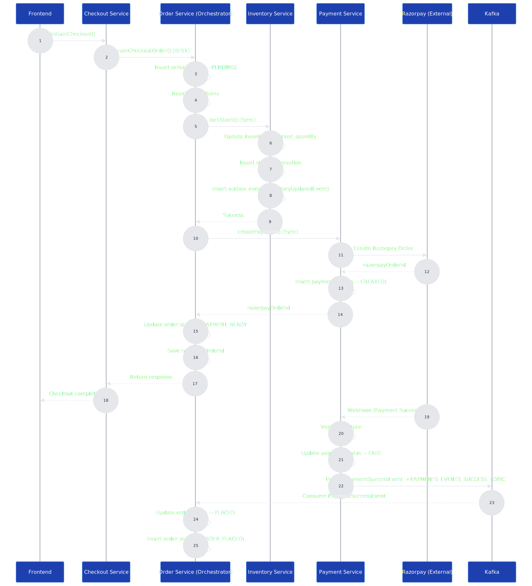
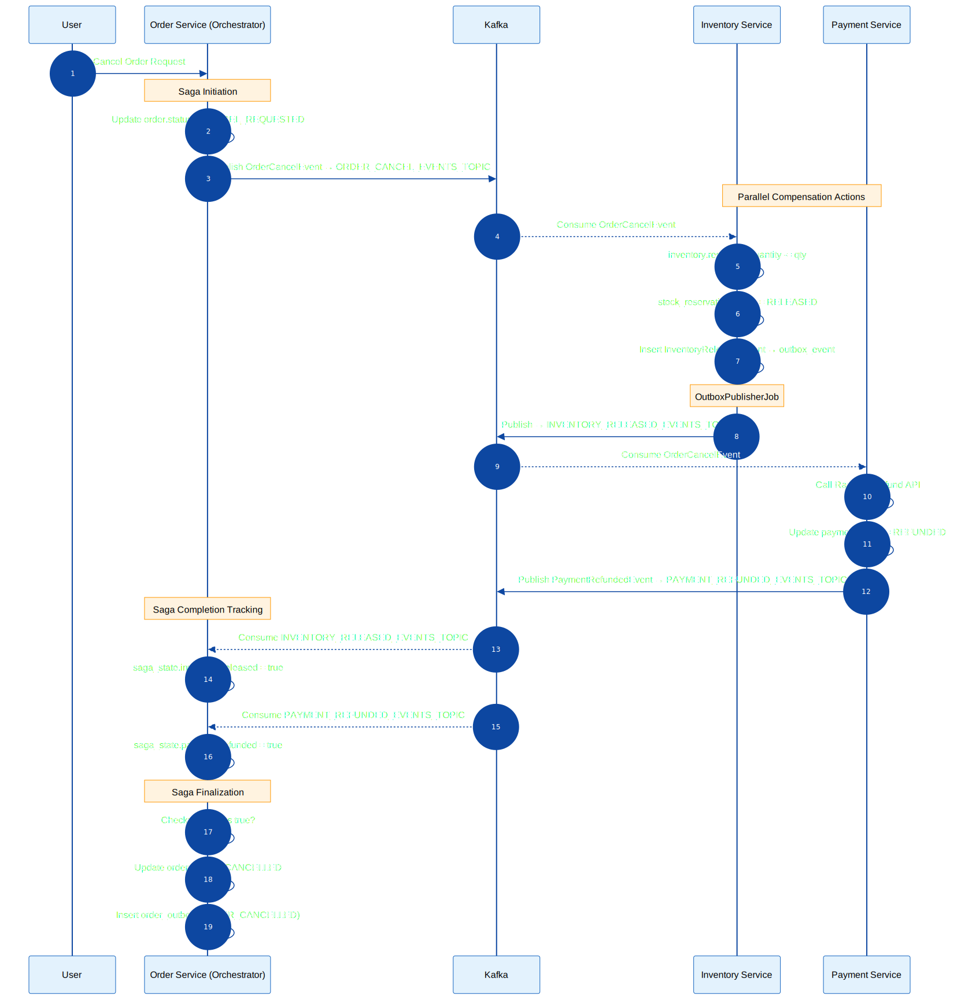

# 🛒 Full Stack Microservices E-Commerce Platform

A production-grade full-stack e-commerce platform built using Spring Boot microservices 
with API Gateway, Eureka service discovery, Kafka event-driven communication, 
Saga pattern for distributed transactions, Redis caching, Elasticsearch search, 
and Razorpay payment integration.

---

# 🏗 System Architecture Overview

<p align="center">
  
</p>

This diagram represents the complete microservices ecosystem including:

- API Gateway for routing
- Eureka for service discovery
- Kafka for asynchronous event communication
- Redis for cart storage & idempotency
- Elasticsearch for search functionality
- Separate database per service
- Razorpay external payment integration

---

# 🖥 Frontend

The frontend application provides:

- Product browsing
- Search functionality
- Cart management
- Checkout flow
- Order history
- User authentication

The frontend communicates with backend services through the API Gateway.

---

# 🔹 Microservices Overview

## Core Commerce Services

- **product-service** – Manages product catalog.
- **search-service** – Handles search functionality using Elasticsearch.
- **cart-service** – Stores cart data in Redis (key-value store).
- **checkout-service** – Manages checkout session & idempotency.
- **order-service** – Handles order lifecycle & acts as Saga Orchestrator.
- **inventory-service** – Manages stock reservation & release.
- **payment-service** – Integrates with Razorpay and manages payments.

## User Domain Services

- **user-service** – User profile & authentication.
- **wishlist-service** – Wishlist management.
- **rating-service** – Product ratings & reviews.

## Supporting Services

- **notification-service** – Handles notifications.

---

# 🔄 Order Creation Flow

<p align="center">
  
</p>

### Flow Summary

1. Checkout-service calls order-service (sync REST).
2. Order-service creates order (status = PENDING).
3. Order-service locks inventory (sync REST).
4. Order-service creates payment (sync REST).
5. Razorpay webhook confirms payment.
6. Payment-service publishes `PaymentSuccessEvent` to Kafka.
7. Order-service consumes event and updates status → PLACED.

---

# 🔁 Cancellation Saga Flow (Orchestrated Saga)

<p align="center">
  
</p>

### Compensation Steps

1. Order status → CANCEL_REQUESTED.
2. Order-service publishes `OrderCancelEvent`.
3. Inventory-service releases stock.
4. Payment-service processes refund.
5. Saga state tracked in `saga_state` table.
6. When both compensation steps complete → status = CANCELLED.

---

# 📦 Transactional Outbox Pattern

To ensure reliable event publishing:

- **inventory-service** uses `outbox_event` table.
- **order-service** uses `order_outbox` table.
- Events are written in the same DB transaction.
- Scheduled publisher sends events to Kafka.
- Prevents data inconsistency and event loss.

---

# 🔁 Communication Model

## Synchronous (REST / Feign)
- checkout → order
- order → inventory
- order → payment

## Asynchronous (Kafka Events)
- PaymentSuccessEvent
- PaymentRefundedEvent
- InventoryReleasedEvent
- OrderCancelEvent

---

# 🗄 Storage & Data Layer

- Separate database per microservice.
- Redis used by:
  - cart-service (cart storage)
  - checkout-service (idempotency)
- Elasticsearch used by search-service.
- Saga state stored in `saga_state`.
- Outbox tables used for reliable messaging.

---

# 🛠 Tech Stack

## Backend
- Java
- Spring Boot
- Spring Data JPA
- Spring Kafka
- Feign Client
- Resilience4j

## Frontend
- (Add your frontend tech here)

## Infrastructure
- Kafka
- Redis
- Elasticsearch
- MySQL / PostgreSQL
- Docker
- Maven

---

# 🚀 Running the Project Locally

## Prerequisites
- Docker
- Kafka
- Redis
- MySQL / PostgreSQL

## Start Backend
```bash
docker-compose up --build
```

## Start Frontend
```bash
npm install
npm start
```

---

# 🔐 Environment Configuration

Configure the following environment variables:

- Razorpay API Keys
- Kafka Broker URL
- Database credentials
- Redis configuration

---

# 🛡 Resilience & Reliability

- Circuit breaker using Resilience4j
- Retry mechanisms
- Saga retry scheduler
- Idempotent consumers
- Transactional outbox pattern
- At-least-once Kafka delivery

---

# ⚠️ Troubleshooting

Common issues:

- Kafka consumer not receiving messages
- Razorpay webhook signature validation failure
- Duplicate event processing
- Saga stuck in intermediate state
- Redis cache expiration issues

---

# 📜 License

MIT License (or specify your license)

---

# 👨‍💻 Author

Your Name  
GitHub: YourProfile  
LinkedIn: YourProfile  
